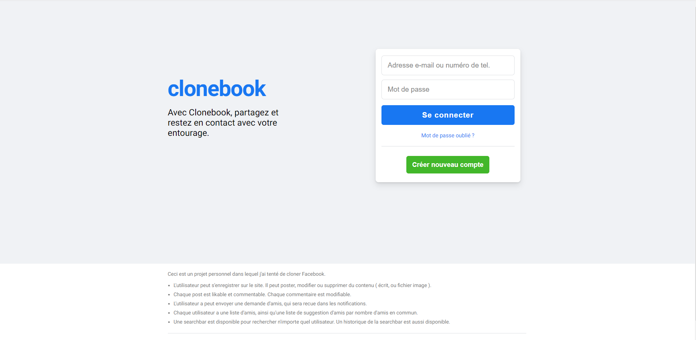

# Clonebook

🌐 Frontend : https://clonebook-super.netlify.app  
🔧 Backend : https://github.com/HugoCalmels/rails-api-social-network  

Clone d’un réseau social permettant aux utilisateurs de publier, commenter, ajouter des amis et interagir via une interface web complète.

Stack : React · Redux · Ruby on Rails · PostgreSQL  
Statut : archive — ancien projet fullstack
